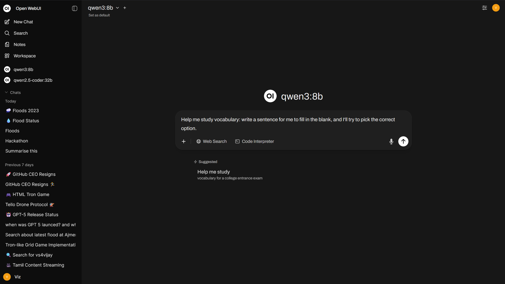

# self-hosted-chatgpt
Self Hosted ChatGPT

- Contained in A Single Docker Compose file




---

## Features

- AI Chat
- Real Time Internet Search
- Knowledge Lookup using RAG


## Installation

Pre-requisites:
- Docker

```bash
docker compose up -d
```

## Running

- Navigate to `http://localhost:8080`

---

## Customization

- This uses `qwen3:8b` LLM model using ollama, feel free to change this if needed
- Uses SearXNG for Searching on Internet

---

### License

MIT License, Built with: 
- Docker
- Ollama
- OpenWebUI
- SearXNG